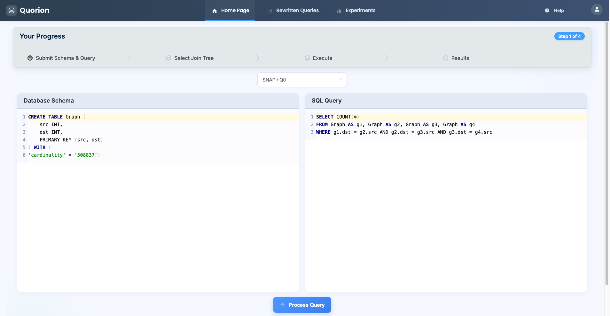
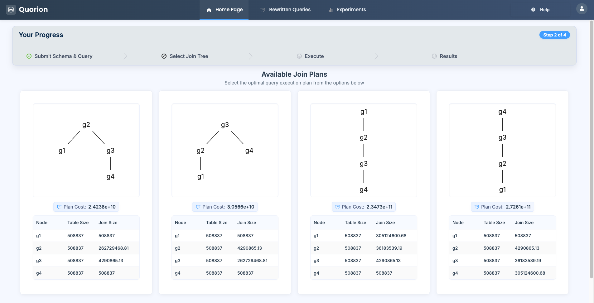
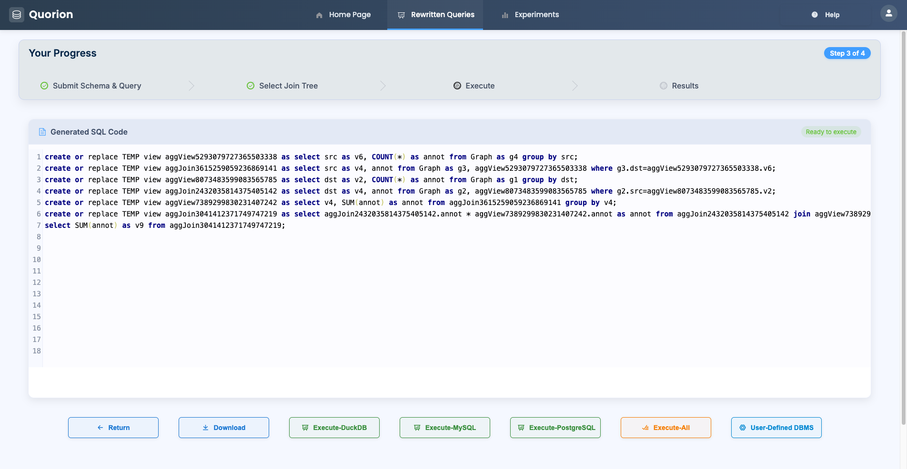
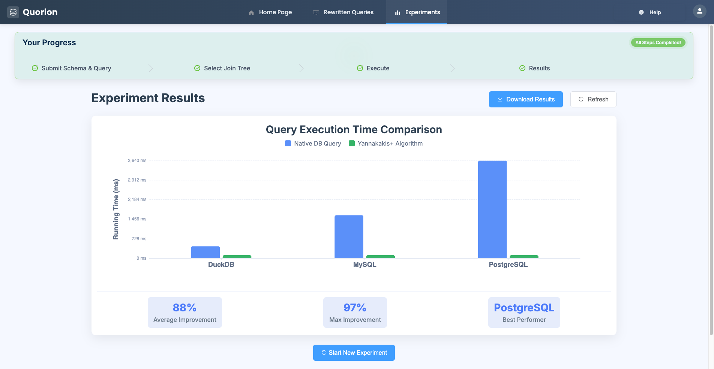

# Query running too slow? Rewrite it with Quorion!

## Part1: Reproducibility of the Experiments
### Step0: Environment Requirements
- Java JDK 1.8
- Scala 2.12.10
- Maven 3.8.6
- Python version >= 3.9
- Python package requirements: docopt, requests, flask, openpyxl, pandas, matplotlib, numpy

### Step1: DBMS Requirement Preparation
#### DuckDB 1.0: 
0. Change directory to any directory that you want to install your DuckDB
1. Download *.zip or *.tar.gz file from https://github.com/duckdb/duckdb/releases/tag/v1.0.0 
2. Extract the content and generate duckdb executable file

#### PostgreSQL 16.2
0. Change directory to any directory that you want to install your PostgreSQL
1. Install PostgreSQL 16.2 according to the instructions on https://www.postgresql.org/download/
2. Create a database `test`. You may use another name for the database.
3. Make sure you can access the database by `/path/to/postgresql-16.2/bin/psql -p {your_port} -d test` (without a password)
4. Install extension after access the database by using command `CREATE EXTENSION file_fdw;`. If executing the command failed, executing the following commands. 
```shell
$ cd /path/to/postgresql-16.2/contrib/file_fdw
$ make
$ make install
$ /path/to/postgresql-16.2/bin/pg_ctl -D /path/to/data stop
$ /path/to/postgresql-16.2/bin/pg_ctl -D /path/to/data start
$ /path/to/postgresql-16.2/bin/psql -p {your_port} -d test
test=# CREATE EXTENSION file_fdw;
```

#### Spark 3.5.1
0. Change directory to any directory that you want to install your Spark
1. Download Spark 3.5.1 from https://archive.apache.org/dist/spark/spark-3.5.1/
2. Extract the downloaded package
3. Set environment variables. Please ensure to modify them according to your file path.
```
export SPARK_HOME="/path/to/spark-3.5.1"
export PATH="${SPARK_HOME}/bin":"${PATH}"
```

### Step2: Dataset Download
#### 1. Graph data
Run `bash download_graph.sh` to download a graph from [SNAP](https://snap.stanford.edu/). It is also possible to use other input data as long as the columns are separated by commas.

#### 2. LSQB data
##### Choice 1: generate by yourself from official site
1. Clone lsqb dataset generate tool from https://github.com/ldbc/lsqb
2. Follow the instruction and generate the scale factor = 30 data result
##### Choice 2: download directly from the cloud storage (~13G)
1. Please download from [lsqb_30](https://hkustconnect-my.sharepoint.com/:f:/g/personal/bchenba_connect_ust_hk/EnqiyJpKU9pLiFhye6B1wc4B33IU2CqRfMoEM31hF9WrBg?e=eE542e). 

#### 3. TPC-H data
##### Choice 1: generate by yourself from official site
1. Clone TPC-H dataset generation tool from https://www.tpc.org/tpc_documents_current_versions/current_specifications5.asp
2. Follow the instruction and generate the scale factor = 100 data result
##### Choice 2: download directly from the cloud storage (~108G)
1. Please download from [tpch_100](https://hkustconnect-my.sharepoint.com/:f:/g/personal/bchenba_connect_ust_hk/EsAuPFzXcb9GpfP143xOPmMBJjga6agVX05bF99ztqNxsQ?e=lOkorH)

#### 4. JOB data
##### Choice 1: download from script (~3.7G, scale=1)
1. Run `bash download_job.sh` to download job data from [DuckDB Support](https://github.com/duckdb/duckdb/blob/main/benchmark/imdb/init/load.sql)
##### Choice 2: download directly from the cloud storage (take some time ~242G, scale=100)
1. Please download from [job_100](https://hkustconnect-my.sharepoint.com/:f:/g/personal/bchenba_connect_ust_hk/EsAuPFzXcb9GpfP143xOPmMBJjga6agVX05bF99ztqNxsQ?e=lOkorH)

#### 5. [Important] Move the data
Move all downloaded data to path `Quorion/Data/[graph|lsqb|tpch|job]`

### Step3: Database Initialization
1. Make sure you have already move the data to path `Quorion/Data/[graph|lsqb|tpch|job]`.
2. Locate to the duckdb installed location and execute `duckdb` to get into duckdb environment. 
3. Replace data default path. Run the command below to replace the data path in `load_[graph|lsqb|tpch|job]_[duckdb|pg].sql`. 
```
$ ./scripts/update_paths.sh
```
4. Change the specifications in `query/config.properties` to set the corresponding PostgreSQL config and DuckDB config. 
5. Then load data to the DuckDB and PostgreSQL by the following commands. 
```
$ ./scripts/load_data_duckdb.sh
$ ./scripts/load_data_pg.sh
```

### Step4: Generate rewritten queries
#### Option1: Use the generated rewritten queries
- Go to Step5 directly. 
#### Option2: Generate rewritten queries by yourself
1. Build *.jar. 
```shell
$ cd SparkSQLPlus
$ mvn clean package
$ cp sqlplus-web/target/sparksql-plus-web-jar-with-dependencies.jar ../
```
2. Change the `Parser config` at `query/config.properties`. 
3. Start parser using command 
```shell
$ bash ./scripts/start_parser.sh
```
4. Execute main.py to launch the Python backend rewriter component.
```shell
$ python main.py
```
5. Generate rewritten queries for DuckDB SQL syntax. 
```shell
./auto_rewrite.sh graph graph_duckdb D N
./auto_rewrite.sh graph graph_pg M N
./auto_rewrite.sh lsqb lsqb D N
./auto_rewrite.sh tpch tpch D N
./auto_rewrite.sh job job D N
```

### Step5: Run experiments
#### Use prepared rewritten queries directly
1. Change the specifications in `query/config.properties`. As for the Experiment config, the default repeat times is 5 and timeout is 7200 seconds. 
2. Execute `./auto_run_duckdb_batch.sh` to run all duckdb experiements, `./auto_run_pg_batch.sh` to run all postgresql experiements. Or run different benchmakr seperately. 
```shell
$ ./auto_run_duckdb_batch.sh
$ ./auto_run_pg_batch.sh
    or
$ ./auto_run_duckdb.sh graph graph_duckdb
$ ./auto_run_duckdb.sh lsqb lsqb
$ ./auto_run_duckdb.sh tpch tpch
$ ./auto_run_duckdb.sh job job

$ ./auto_run_pg.sh graph_pg
$ ./auto_run_pg.sh lsqb
$ ./auto_run_pg.sh tpch
$ ./auto_run_pg.sh job
```
3. The queries for parallism, scale & selectivity is under query directory. 
- For parallism testing, the queries is under query/parallelism_[lsqb|sgpb], please set parallism through
```shell
./auto_run_duckdb.sh parallelism_[lsqb|sgpb] [1|2|4|8|16|32|48]
```
- For scale testing, the queries is under query/scale_[job|lsqb]
- For selectivity testing, the queries is under query/selectivity_[lsqb|tpch]

#### SparkSQL
For details, please refer to the [SparkSQLRunner README](SparkSQLRunner/README.md).


### Step6: plot
1. Execute the following command to gather statistics. The generated statistis is in `summary_*_statistics[_default].csv`. 
```shell
# Gather results for query under directory graph & lsqb & tpch & job
./auto_summary.sh graph
./auto_summary.sh lsqb
./auto_summary.sh tpch
./auto_summary_job.sh job
```
2. Execute scripts under `draw/*` to do the plotting and generated picture is under `draw/*.pdf`. 
```shell
# Generate pictures(graph.pdf, lsqb.pdf, tpch.pdf) about running times for SGPB, LSQB and TPCH. Corresponding to Figure 9. 
python3 draw_graph.py

# Generate pictures(job_duckdb.pdf, job_postgresql.pdf) about running times for JOB. Corresponding to Figure 10. 
python3 draw_job.py

# Generate picture(selectivity_scale.pdf) about selectivity & scale. Corresponding to Figure 11. 
python3 draw_selectivity.py

# Generate pictures(thread1.pdf, thread2.pdf) about parallelism. Corresponding to Figure 12.
python3 draw_thread.py
```

## Part2: Extra Information [Option]

#### Structure Overview
- Web-based Interface
- Java Parser Backend
- Python Optimizer \& Rewriter Backend

0. Preprocessing[option]. 
- Statistics: For generating new statistics (`cost.csv`), we offer the DuckDB version scripts `query/preprocess.sh` and `query/gen_cost.sh`. Modify the configurations in them, and execute the following command. For web-ui, please move the generated statistics files to folder `graph/q1/`, `tpch/q2/`, `lsqb/q1/`, `job/1a/`, and `custom/q1/` respectively; for command-line operations, please move them to the specific corresponding query folders. 
- Plan: Here, we also provide the conversion of DuckDB plans. Please modify the DuckDB and Python paths in gen_plan.sh. Then execute the following command. After running the command, the original DuckDB plan will be generated as `db_plan.json`, and the newly generated plan will be `plan.json`, which is suitable for our parser. Here `${DB_FILE_PATH}` represents a persistent database in DuckDB. Please change the parameter to `timeout=0` in `requests.post` at `main.py:223` if you want to use the self-defined plan. 
```shell
$ ./gen_plan.sh ${DB_FILE_PATH} ${QUERY_DIRECTORY}
e.g.
./gen_plan.sh ~/test_db job
```
1. We provide two execution modes. The default mode is web-ui execution. If you need to switch, please modify the corresponding value `EXEC_MODE` at Line `767` in `main.py`.

#### Web-UI
2. Execute main.py to launch the Python backend rewriter component.
```shell
$ python main.py
```
3. Execute the Java backend parser component through command `java -jar sparksql-plus-web-jar-with-dependencies.jar` build from `SparkSQLPlus`, which is included as a submodule. [Option] You can also build `jar` file by yourself. 
4. Please use the following command to init and update it. 
```shell
$ git submodule init
$ git submodule update [--remote]
    or
$ git submodule update --init --recursive
```
5. Open the webpage at `http://localhost:8848`.
6. Begin submitting queries for execution on the webpage.

#### Command Line [Default]
2. Modify python path (`PYTHON_ENV`) in `auto_rewrite.sh`.
3. Execute the following command to get the rewrite querys. The rewrite time is shown in `rewrite_time.txt`
4. OPTIONS
- Mode: Set generate code mode D(DuckDB)/M(MySql) [default: D]
- Yannakakis/Yannakakis-Plus
: Set Y for Yannakakis; N for Yannakakis-Plus
 [default: N]
```shell
$ bash start_parser.sh
$ Parser started.
$ ./auto_rewrite.sh ${DDL_NAME} ${QUERY_DIR} [OPTIONS]
e.g ./auto_rewrite.sh lsqb lsqb M N
```
5. If you want to run a single query, please change the code commented `# NOTE: single query keeps here` in function `init_global_vars` (Line `587` - Line `589` in `main.py`), and comment the code block labeled `# NOTE: auto-rewrite keeps here` (the code between the two blank lines, Line `610` - Line `629` in `main.py`).


#### Files
- `./query/[graph|lsqb|tpch|job]`: plans for different DBMSs
- `./query/*.sh`: auto-run scripts
- `./query/*.sql`: load data scripts
- `./query/[src|Schema]`: files for auto-run SparkSQL
- `./*.py`: code for rewriter and optimizer
- `./sparksql-plus-web-jar-with-dependencies.jar`: parser jar file

### Demonstration
#### Step 1

#### Step 2

#### Step 3

#### Step 4


#### NOTE
- For queries like `SELECT DISTINCT ...`, please remove `DISTINCT` keyword before parsing. 
- Use `jps` command to get the parser pid which name is `jar`, and then kill it. 

