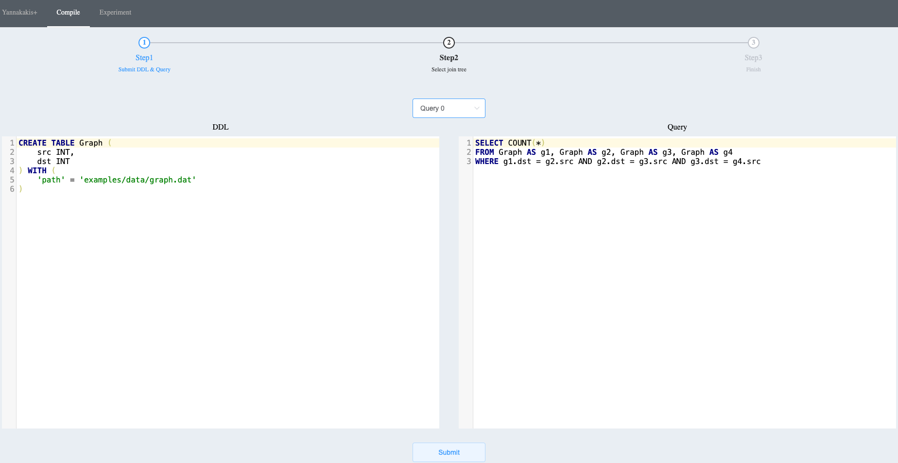
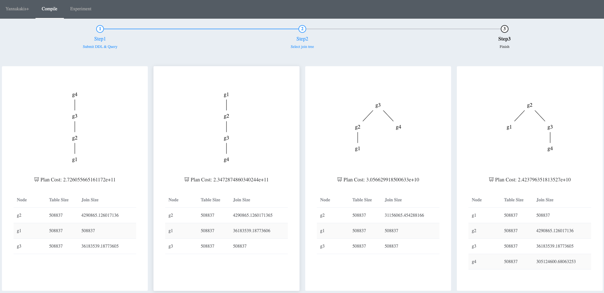
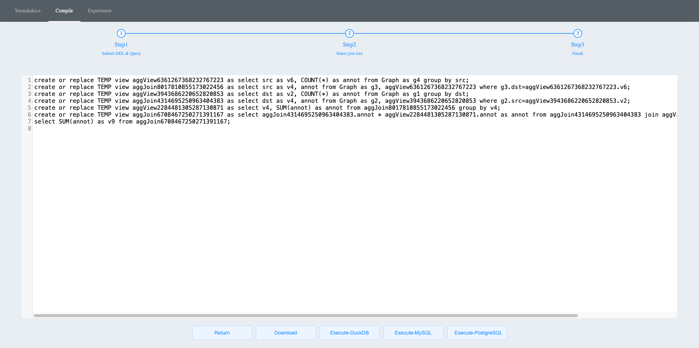
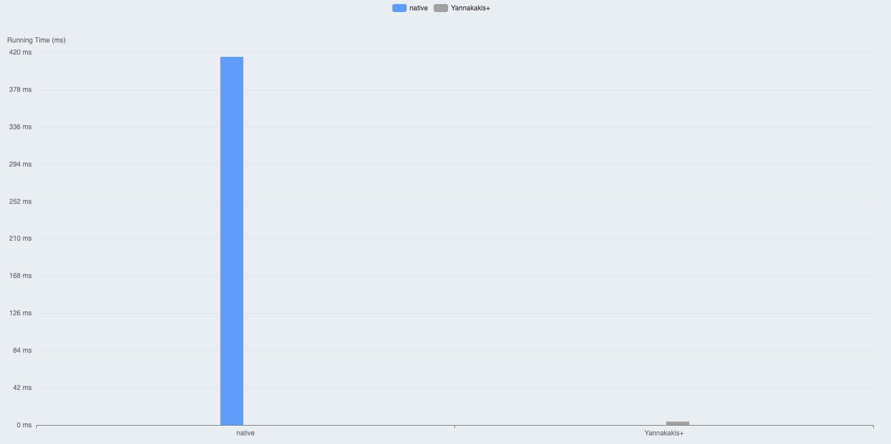

# Query running too slow? Rewrite it with Quorion!


### Requirements
- Java JDK 1.8
- Scala 2.12.10
- Maven 3.8.6
- Python version >= 3.9
- Python package requirements: docopt, requests, flask, openpyxl, pandas

### Steps
0. Preprocessing[option]. 
- Statistics: For generating new statistics (`cost.csv`), we offer the DuckDB version scripts `query/preprocess.sh` and `query/gen_cost.sh`. Modify the configurations in them, and execute the following command. For web-ui, please move the generated statistics files to folder `graph/q1/`, `tpch/q2/`, `lsqb/q1/`, `job/1a/`, and `custom/q1/` respectively; for command-line operations, please move them to the specific corresponding query folders. 
- Plan: Here, we also provide the conversion of DuckDB plans. Please modify the DuckDB and Python paths in gen_plan.sh. Then execute the following command. After running the command, the original DuckDB plan will be generated as `db_plan.json`, and the newly generated plan will be `plan.json`, which is suitable for our parser. Here `${DB_FILE_PATH}` represents a persistent database in DuckDB. 
```
$ ./gen_plan.sh ${DB_FILE_PATH} ${QUERY_DIRECTORY}
e.g.
./gen_plan.sh ~/test_db job
```
1. We provide two execution modes. The default mode is web-ui execution. If you need to switch, please modify the corresponding value `EXEC_MODE` at Line `767` in `main.py`.

#### Web-UI
2. Execute main.py to launch the Python backend rewriter component.
```
$ python main.py
```
3. Execute the Java backend parser component through command `java -jar sparksql-plus-web-jar-with-dependencies.jar` build from `SparkSQLPlus`, which is included as a submodule. [Option] You can also build `jar` file by yourself. 
4. Please use the following command to init and update it. 
```
$ git submodule init
$ git submodule update [--remote]
    or
$ git submodule update --init --recursive
```
5. Open the webpage at `http://localhost:8848`.
6. Begin submitting queries for execution on the webpage.

#### Command Line
2. Modify python path (`PYTHON_ENV`) in `auto_rewrite.sh`.
3. Execute the following command to get the rewrite querys. The rewrite time is shown in `rewrite_time.txt`
4. OPTIONS
- Mode: Set generate code mode D(DuckDB)/M(MySql) [default: D]
- Yannakakis/Yannakakis-Plus
: Set Y for Yannakakis; N for Yannakakis-Plus
 [default: N]
```
$ bash start_parser.sh
$ Parser started.
$ ./auto_rewrite.sh ${DDL_NAME} ${QUERY_DIR} [OPTIONS]
e.g ./auto_rewrite.sh lsqb lsqb M N
```
5. Modify configurations in `query/load_XXX.sql` (load table schemas) and `query/auto_run_XXX.sh` (auto-run script for different DBMSs). 
6. Execute the following command to execute the queries in different DBMSs.
```
$ ./auto_run_XXX.sh [OPTIONS]
```
7. If you want to run a single query, please change the code commented `# NOTE: single query keeps here` in function `init_global_vars` (Line `587` - Line `589` in `main.py`), and comment the code block labeled `# NOTE: auto-rewrite keeps here` (the code between the two blank lines, Line `610` - Line `629` in `main.py`).

### Structure
#### Overview
- Web-based Interface
- Java Parser Backend
- Python Optimizer \& Rewriter Backend

#### Files
- `./query/[graph|lsqb|tpch|job]`: plans for different DBMSs
- `./query/*.sh`: auto-run scripts
- `./query/*.sql`: load data scripts
- `./query/[src|Schema]`: files for auto-run SparkSQL
- `./*.py`: code for rewriter and optimizer
- `./sparksql-plus-web-jar-with-dependencies.jar`: parser jar file

### Demonstration
#### Step 1

#### Step 2

#### Step 3

#### Step 4


#### NOTE
- For queries like `SELECT DISTINCT ...`, please remove `DISTINCT` keyword before parsing. 
- Use `jps` command to get the parser pid which name is `jar`, and then kill it. 

